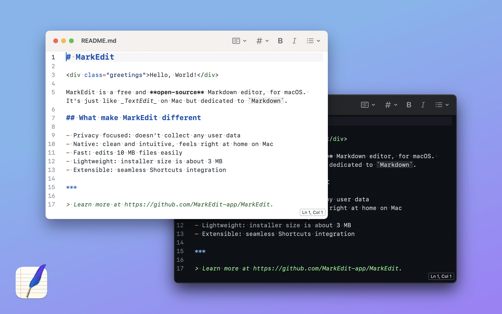

# Editores de texto Markdown para computadora
Puede utilizar un editor de Markdown para trabajar localmente en su computadora

Los editores de Markdown en muchos casos permiten escribir sin tener que conocer los elementos de sintaxis de Markdown, permitiendo escribir de manera similar a como se hace en Word u otros editores de texto.

[[toc]]

## macOS
En macOS se recomienda utilizar el editor open source [MarkEdit](https://github.com/MarkEdit-app/MarkEdit), el cual se puede descargar desde el [App Store](https://apps.apple.com/us/app/markedit-for-markdown/id1669953820?mt=12). 

## Linux
Para Linux una buena opción es [ghostwriter](https://github.com/KDE/ghostwriter).
### Ubuntu/Debian

Ingrese los siguientes comandos en terminal:
```bash
$ sudo apt update
$ sudo apt install ghostwriter
```

En caso de que su distribución de Linux esté desactualizada, y está utilizando Ubuntu o uno de sus derivados (Linux Mint, Xubuntu, etc.), abra una terminal e ingresa los siguientes comandos:

```bash
$ sudo add-apt-repository ppa:wereturtle/ppa
$ sudo apt update
$ sudo apt install ghostwriter
```

### Fedora
En Fedora, en cambio, ingrese el siguiente comando e terminal:

```bash
$ sudo dnf install ghostwriter
```

## Windows
Para Windows se puede utilizar [ghostwriter](https://ghostwriter.kde.org).

Cabe mencionar que ghostwriter tiene algunas características como inserción de texto matemático con MathJAX, que no es soportada por el sitio web. Para más recomendaciones de editores de texto Markdown, se refiere al usuario a la lista [awesome-markdown-editors](https://github.com/mundimark/awesome-markdown-editors), el cual también menciona editores en la web.