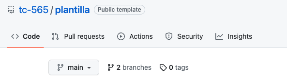
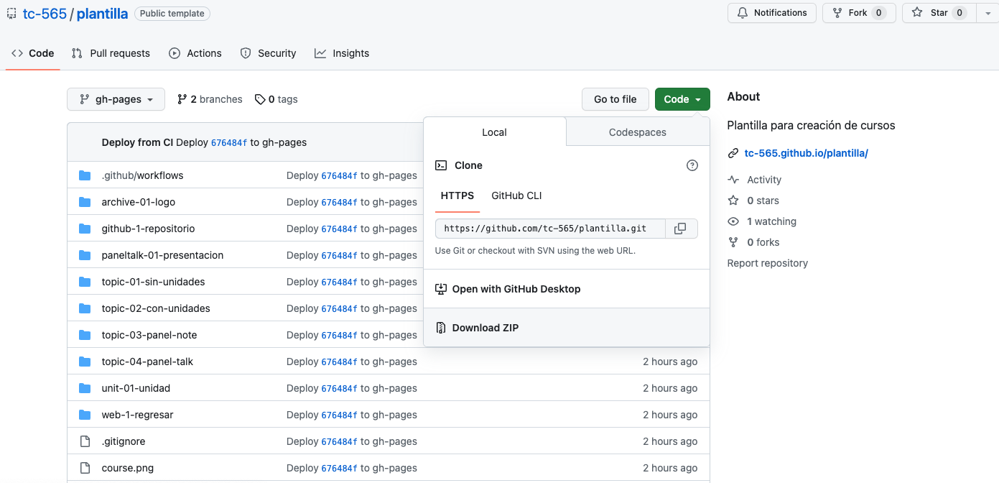
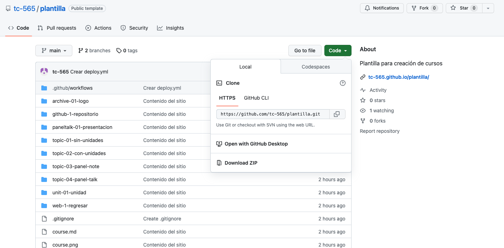

# Cómo descargar un curso
Cómo descargar un curso compilado y sin compilar

[[toc]]

Una de las facilidades provistas por la manera en la que alojamos los cursos en GitHub es la posibilidad de descargar un curso como un sitio web local para uso offline, o la descarga del código fuente de un curso.

## Descarga de curso compilado
1. Para descargar un curso/sitio web para uso offline, primero se debe ingresar en el navegador al enlace del repositorio con el material del curso. Este enlace es de la forma `https://github.com/usuario/nombre-de-curso`.
2. Una vez en el repositorio deseado, verá un encabezado donde dice branches y tags como se puede apreciar en la siguiente image. 
3. En él, presione en el menú expandible, y presione `gh-pages`. Alternativamente, diríjase al enlace de la forma `https://github.com/usuario/nombre-de-curso/tree/gh-pages`.
4. Ahora, presione en el botón verde `Code`, y seleccione `Download ZIP`. 
5. Una vez descargado, en su carpeta de descargas ubique el archivo descargado y descomprímalo presionándolo dos veces.
6. El archivo descomprimido resultante será una carpeta, dentro de la cual encontrará un archivo llamado `index.html`. Presiónelo dos veces para abrirlo con su navegador, o en su defecto presiónelo con click derecho, seleccione la opción de abrir con el navegador (Safari, Edge, Chrome, Firefox, etc).

## Descarga de curso sin compilar
Esta modalidad está dirigida sobretodo para el desarrollo de cursos, por lo que si en realidad está interesado en descargar un sitio funcional, devuélvase al título `Descarga de curso compilado`.

1. Presione en el botón verde `Code`, y seleccione `Download ZIP`. 
2. Una vez descargado, en su carpeta de descargas ubique el archivo descargado y descomprímalo presionándolo dos veces.