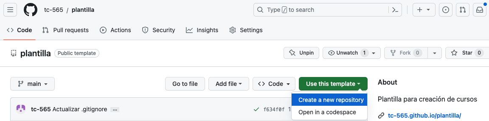
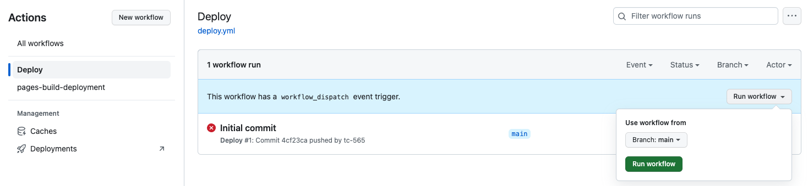
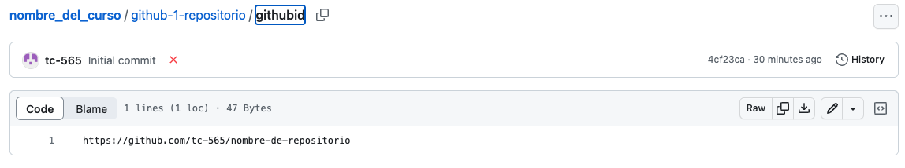
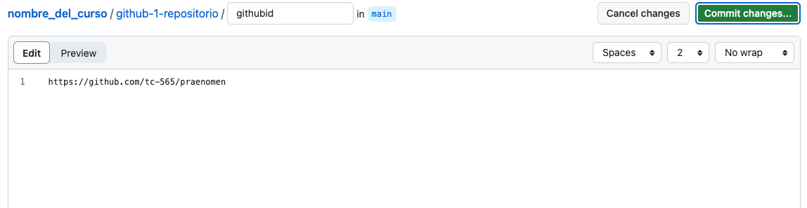
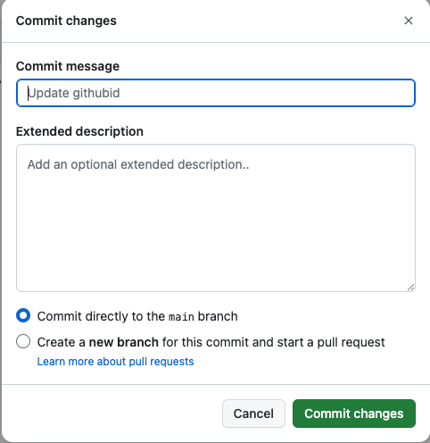

# Clonación y edición de la plantilla de cursos
Clone la plantilla para crear un nuevo curso

[[toc]]

## Clonación de la plantilla
Para crear un curso, primero se procederá a clonar la plantilla de cursos creada para tal fin. Siempre que vaya a crear un nuevo curso, repita este proceso, debido a que si empieza con un curso anteriormente como base, puede se estén omitiendo mejoras en el compilador por mencionar un caso. Estas mejoras sí se obtendrían de la plantilla.

Al editar la plantilla **no borre el archivo `.gitignore` ni el directorio `.github`**. Además, **mantenga sin cambios el directorio `web-1-regresar`**. 

1. Ingrese a su cuenta de GitHub.
2. Diríjase a [https://github.com/tc-565/plantilla](https://github.com/tc-565/plantilla).
3. Presione el botón de color verde `Use this template`, y luego presione `Create a new repository`. 
4. Ahora estará en una ventana con título `Create a new repository`. Allí, seleccione la casilla `Include all branches` (si la casilla no aparece, ignórelo y continúe), escriba el nombre de su curso sin espacios, y escriba una breve descripción del curso. 
5. Seleccione `Public`, y presione `Create repository`.

## Habilitación de GH-pages y compilación automática
Ahora se va a proceder a habilitar GH-pages y GitHub actions, lo cual permitirá la compilación del sitio web y visualización del mismo en la nube.

1. Diríjase a la pestaña settings dentro del nuevo repositorio, y en la barra horizontal seleccione `Actions` y luego `General`. Hacia abajo encontrará el título `Workflow permissions`. Bajo este título, seleccione la opción `Read and write permissions`, y más abajo presione `Save`.
2. De esta manera, la compilación automática del sitio ya ha sido activada, y esta será ejecutada cada vez que se hagan cambios en los contenidos del curso.
3. Finalmente, vaya a `Settings`, luego a `Pages` en la barra lateral izquierda, y bajo el título `Build and Deplyment`, bajo `Source` escoja la opción `Deploy from a branch`. Revise que en el título `branch` (está ubicado después de `source`) esta rama sea `gh-pages`. 

### Compilación manual
1. La acción de compilación del sitio también puede ser accionada de manera manual. Para ello, diríjase a la pestaña `Actions`. Una vez allí, en la barra lateral, seleccione `Deploy`.
2. Ahora podrá ver una barra azul que hacia el final tiene un botón que dice `Run workflow`, presiónelo. Luego, asegúrese de que debajo de `Use workflow from`, diga `Branch: main`. Si es así, presione `Run workflow` para compilar el sitio de manera manual. 

### Visualizar el sitio

Para visualizar el sitio, si su nombre de usuario es “emma01", y el nombre del curso que creó es “cursoAprendizaje”, basta dirigirse a https://emma01.github.io/cursoAprendizaje/ para ver el sitio web ya desplegado. Tome en cuenta que la compilación del sitio web en la nube no es inmediata, ya que se está haciendo uso de recursos computacionales compartidos.

Alternativamente, puede dirigirse a la pestaña `Code`, y en la columna lateral derecha encontrará un título que dice `Deployments`, presiónelo. Allí encontrará el sitio web donde puede consultar su curso ya compilado.

**Nota:** es posible que por errores a la hora de crear un curso, este no se pueda compilar. Si este es el caso, en `Deployments` podrá ver que la última acción “Deploy” falló.

## Edición de la plantilla

Para poder adaptar la plantilla a sus necesidades, se requiere aprender como modificar y subir archivos en la nube.

### Interfaz de GitHub
Para editar los archivos de un curso desde GitHub, debe primero dirigirse a la pestaña `Code`.

Además, verifique que debajo del nombre del curso donde aparece su foto de perfil diga `Main`, al lado de `branches` y `tags`.

#### Editando archivos existentes
1. Seleccione el archivo que desea editar. 
2. Una vez seleccionado, podrá ver justo encima del texto del archivo, una barra con distintos íconos. Presione el ícono con forma de lápiz.
3. Edite el texto.
4. Presione el botón verde `Commit Changes`. 
5. Aparecerá una ventana que dice `Commit changes`. En ella, escriba palabras clave para los cambios que hizo bajo el título `Commit message`, y bajo `Extended description` escriba una descripción más detallada de los cambios si lo considera necesario.
6. Presione el botón verde `Commit Changes`. 

#### Crear archivos desde GitHub
1. Proceda al directorio en el cual desea crear un nuevo archivo.
2. Seleccione el botón `Add file`, y bajo él `Create new file`.
3. Escriba un nombre y **extensión** para el archivo.
4. Edite el texto del archivo.
5. Presione el botón verde `Commit Changes`. 
6. Aparecerá una ventana que dice `Commit changes`. En ella, escriba palabras clave para los cambios que hizo bajo el título `Commit message`, y bajo `Extended description` escriba una descripción más detallada de los cambios si lo considera necesario.
7. Presione el botón verde `Commit Changes`. 

#### Borrar archivos desde GitHub
1. Seleccione el archivo o folder que desea eliminar.
2. Una vez en él, presione el botón con tres puntos en la parte superior derecha.
3. Seleccione el texto en rojo `Delete directory` o `Delete file` según corresponda.
4. Aparecerá una ventana que dice `Commit changes`. En ella, escriba palabras clave para los cambios que hizo, puede además escribir una descripción más detallada de los cambios si lo considera necesario.
5. Presione el botón verde `Commit Changes`.

#### Subiendo archivos desde la computadora
1. Proceda al directorio en el cual desea subir un nuevo archivo.
2. Seleccione el botón `Add file`, y bajo él `Upload files`.
3. Arrastre los archivos que desea subir, o presione `choose your files` para escogerlo con el gestionador de archivos de su sistema operativo.
4. Abajo verá un rectángulo que dice `Commit changes`. En él, escriba palabras clave para los cambios que hizo, puede además escribir una descripción más detallada de los cambios si lo considera necesario.
5. Presione el botón verde `Commit Changes`.

### GitHub Codespaces (Opcional)
Esta opción de edición consiste en abrir un editor de texto en el navegador dentro de GitHub, similar al popular editor de texto Visual Studio Code. Este ambiente se llama GitHub Codespaces. Cuenta con algunas limitaciones, por ejemplo una restricción mensual de horas de uso del mismo.
1. Presione el botón verde `Code`.
2. En la ventana que se desplegó, presione la pestaña `Codespaces`.
3. Presione el botón `Create codespace on main`.
4. Allí podrá ver los contenidos de su curso, seleccionarlos y editarlos in situ.
5. Para que los cambios tomen efecto y no se pierdan, seleccione el tercer ícono en la barra lateral izquierda que parece una bifurcación.
6. Presione donde dice `Message`, y escriba palabras clave para los cambios que hizo. Abajo, mueva el puntero hacia los archivos que modificó, y presione el símbolo + que aparece al extremo de cada uno de ellos. **Nota:** no se espere a tener muchos cambios antes de hacer un commit. Sea ordenado, haga cambios relacionados entre sí en un mismo commit.
7. Presione el botón azul que dice commit.

**Importante:** para salir de GitHub Codespaces no basta con cerrar la ventana del navegador, ya que de lo contrario estará agotando en vano su tiempo de uso mensual.
1. Seleccione el ícono de tres líneas horizontales en la columna del extremo izquierdo.
2. Seleccione `My Codespaces`.
3. En la nueva ventana, ubique el Codespace que estaba utilizando, y seleccione los tres puntos en su extremo derecho.
4. Seleccione `Stop Codespace`.